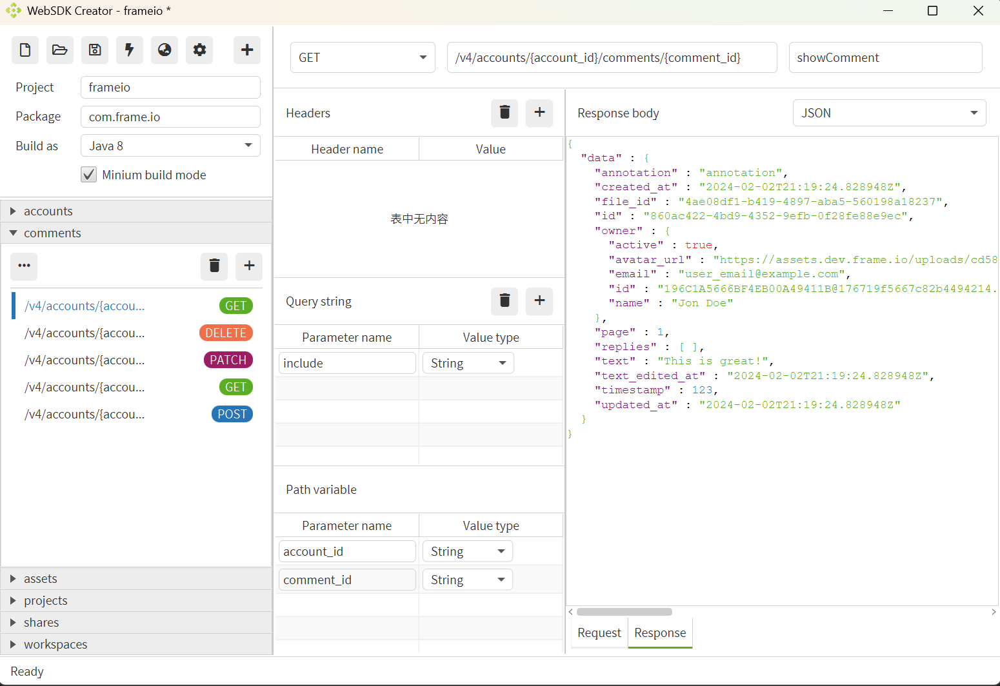
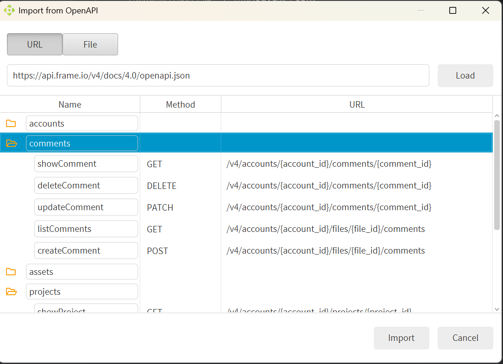

# Web SDK Builder
- - -
由于生成为WebAPI生成JavaSDK的项目，通过收集Web API公开的Http访问端点，
可以快速而有效的生成一个可用的Java版本SDK。

本项目通过标准的Java编译API编译这些源码，可以直接生成对应的类库，同时也会
提供一份对应的pom文件方便导入到其他的IDE进行修改。

目前，这个项目处于早期阶段。

## 已知限制

仅支持“GET/POST/DELETE/PUT/PATCH”方法。

对于Request，仅支持“application/json”和“application/x-www-form-urlencoded”类型的body，

对于Response，仅支持“application/json”。

## 截图

